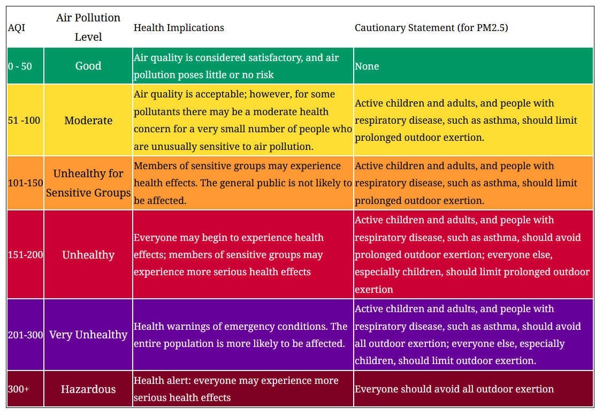

```{r , echo = FALSE, message = FALSE, warning = FALSE, include=FALSE}
knitr::opts_chunk$set(echo = FALSE, 
                      message=FALSE, 
                      warning=FALSE)

                    
library(tidyverse)
library(readr)
library(kableExtra)
library(bookdown)
library(ggplot2)
library(ggpubr)
library(plotly)
library(data.table)
library(scales)
library(stringr)      
library(formattable)
library(tidyr)
```


## Fire Detections and Land Type in Bushfire Season


```{r fire, warning=FALSE, echo=FALSE, eval=TRUE, message=FALSE}

# 5. What is the number of fire detection

fire_detect <- read_csv("data/Table_MODIS_fire_counts_2002_2019_Victoria_per_fire_year.csv")
country_area_state <- read_csv("data/country_area_state.csv")
melb_air <- read_csv("data/melb_air.csv")
fire_detect_nw <- read_csv("data/fire_detect_nw.csv")
fire_total_detects <- read_csv("data/fire_total_detects.csv")
perc_affected_state <- read_csv("data/perc_affected_state.csv")
ft2total <- read_csv("data/ft2total.csv")
ft3burnt <-  read_csv("data/ft3burnt.csv")
ft4perc  <- read_csv("data/ft4perc.csv")
  
```


```{r}

ggplot(fire_detect_nw) +
  geom_col(aes(x = Years, 
               y = Counts),
           fill= 'coral3') +
  coord_flip() +
  scale_x_discrete() +
  labs(caption = "Visualisation per number of fire observations by year") 
  

```


```{r}


fire_total_detects %>% 
  rename("Total Counts" = n) %>% 
  kable(caption = "Total detections by year", ) %>%
  kable_styling(c("hover", 
                  "condensed",
                  position = "center", 
                  fixed_thead = TRUE))


```


```{r}
#percentage of burnt land by state
perc_affected_state <- perc_affected_state  %>%
  select(Jurisdiction, 
         `Proportion of fire area that is forested (perc)`) %>% 
  mutate("Proportion of fire" = 100-`Proportion of fire area that is forested (perc)`) %>% 
  pivot_longer(names_to = "Burnt Area", values_to = "Percentage", cols = -Jurisdiction)
```


```{r}
ggplot(data = perc_affected_state, aes(x = Jurisdiction,
                           y = Percentage, fill= `Burnt Area`)) +
    geom_bar(position="stack", stat="identity")+ 
    geom_text(aes(label = paste0(round(Percentage,2),"%")), position = position_stack(vjust = 0.5), size = 3)+
    scale_y_continuous(labels = function(x) paste0(x, "%"), 
                       breaks = seq(0, 100, 10))+
    coord_flip()+
    theme_bw()+
    theme(legend.position = "bottom")
   
  
 
```


```{r}

#Victoria Percentage

ft4perc <- ft4perc  %>% 
  select(...1,Vic.) %>% 
  rename("Type of Forest" = ...1, "Burnt Land" = Vic.) %>% 
  filter(`Type of Forest` %in% 
           c("Leasehold forest", 
             "Multiple-use public forest", 
             "Nature conservation reserve", 
             "Other Crown land", 
             "Private forest", 
             "Unresolved tenure")) %>% 
  mutate("Safe Land" = 100-`Burnt Land`) %>% 
  pivot_longer(names_to = "Burnt Area Victoria", values_to = "Percentage", cols = -`Type of Forest`)

  ggplot(data = ft4perc, aes(x = `Type of Forest`,
                           y = Percentage, fill= `Burnt Area Victoria`)) +
    geom_bar(position= position_stack(reverse = T), stat="identity")+
    coord_flip()+
    theme(legend.position = "bottom")+
    geom_text(aes(label = paste0(round(Percentage,2),"%")), position = position_stack(vjust = 0.5, reverse = T), size = 3)

```


```{r , warning=FALSE}


# 6. What was the effect on the air pollution index in Melbourne city in January 2020 ?

melb_air2 <- melb_air %>%  select(date,pm25) %>% 
  mutate(date = as.Date(date, format = "%d/%m/%Y"))

melb_air2 %>%
  ggplot()+
  geom_line(aes(x = date, 
                y = pm25), 
            colour = "#FF6600")+
  theme_bw()+
  labs(x = "3 Year Historical Melbourne Air Index", 
       y = "Air Index Score")+
  scale_y_continuous(limits = c(0,280),
                     breaks = seq(0,280,50))


```

```{r, fig.height='50%', fig.align='center'}



```


```{r}


melb2020 <- melb_air2 %>% 
  filter(date >= "2019-12-01" & date <= "2020-03-30" ) %>% 
  

 ggplot()+
  geom_line(aes(x = date, 
                y = pm25), 
            colour = "#FF6600")+
  theme_bw()+
  labs(x = "Melbourne Air Index in 2020 (January to April)", 
       y = "Air Index Score")+
  scale_y_continuous(limits = c(0,300),
                     breaks = seq(0,300,20))

ggplotly(melb2020)

```


